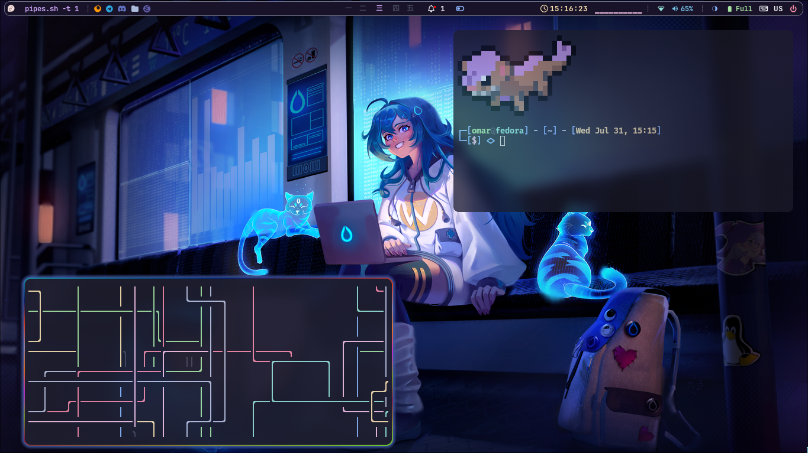
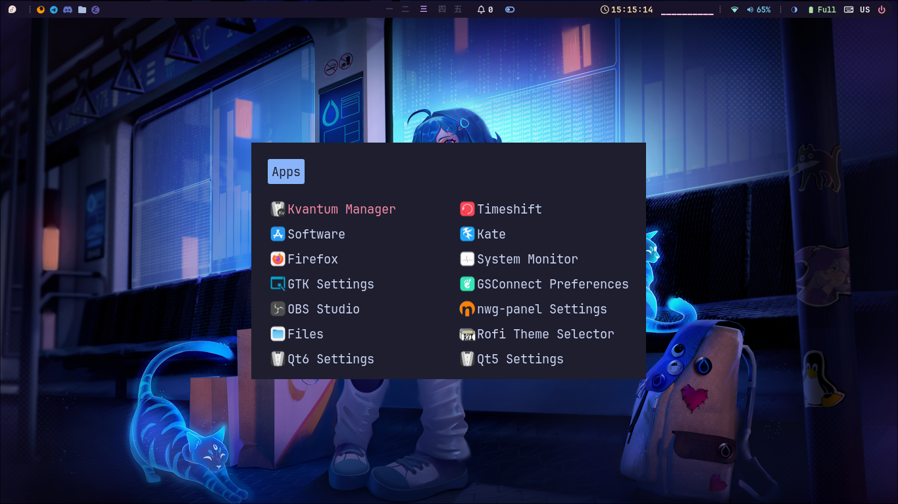
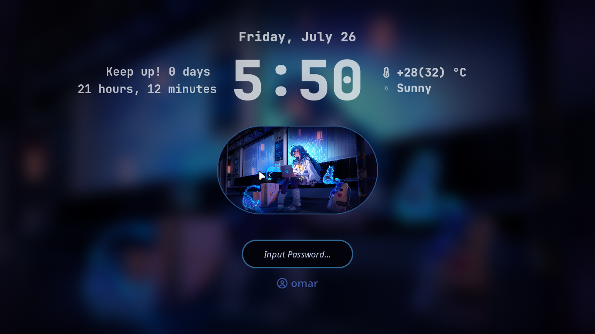
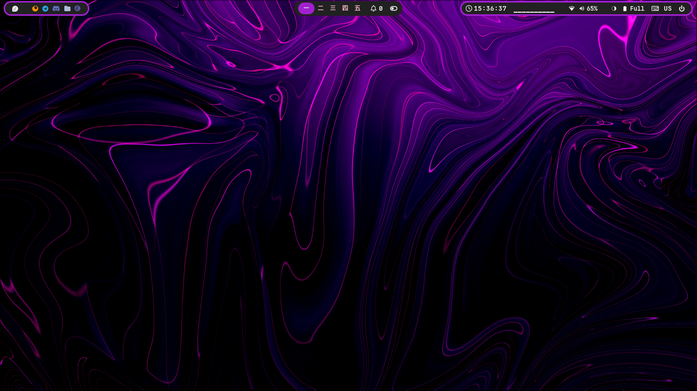
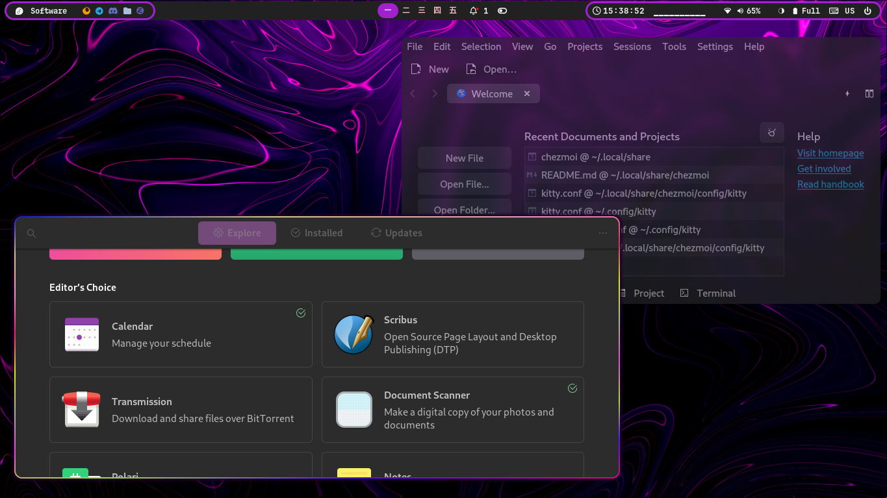
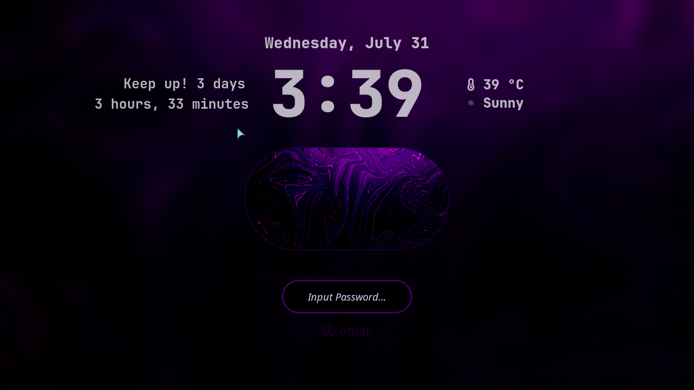
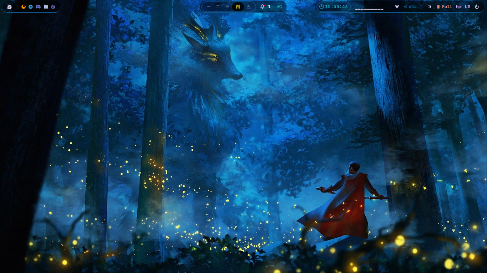
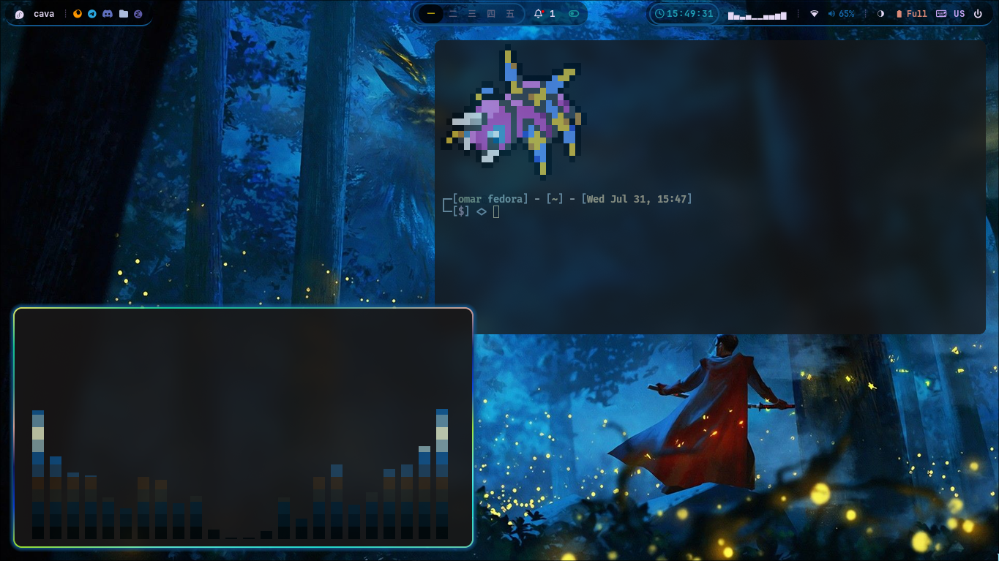
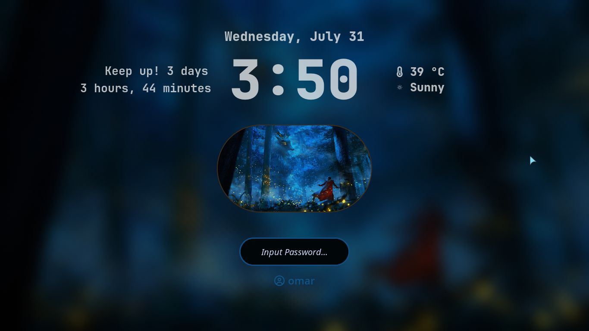

# Hyprland Dotfiles

These are my Hyprland configuration files. They are based on [JaKooLit's Hyprland dotfiles](https://github.com/JaKooLit/Hyprland-Dots) with custom configurations tailored to my preferences.

# Custom Configurations

**Waybar**

 - Added modules, styles, and configurations.
 - Removed duplicated Wi-Fi icon by flagging nm-applet --indicator in Startup_Apps.conf.

**Keyboard Layout**

 - Changed keyboard layout switching method: Disabled SwitchKeyboardLayout.sh by renaming it to .sh.bak. Using UserSettings.conf for kb_layout and kb_options along with the "hyprland/language" module in Waybar, update keyboard layout in UserSettings.conf under the input section. If the "hyprland/language" module doesn't work, update ~/.config/waybar/modules with your keyboard name using hyprctl devices to find it.

**Hyprlock**

 - Added scripts to display uptime on the lock screen.

**Themes**

 - Added Catppuccin [GTK](https://www.gnome-look.org/p/1715554/) and [Kvantum](https://github.com/catppuccin/Kvantum) themes for a cohesive look across all apps.
 - Personalized appearance with a preferred color scheme.

# Screenshots

***Catppuccin Mocha***

***Graphite Purple Dark***

***Andromeda***

# Acknowledgements

A big thank you to [JaKooLit](https://github.com/JaKooLit) for the original Hyprland dotfiles which served as the foundation for my configurations.
