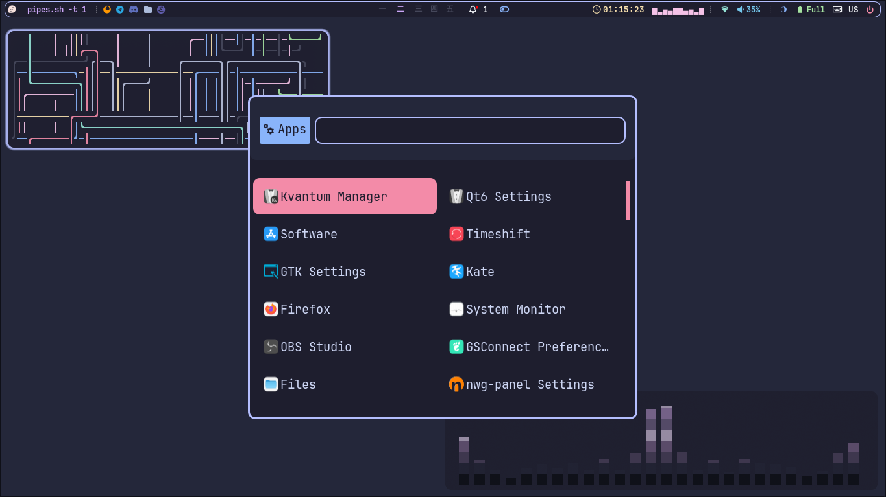
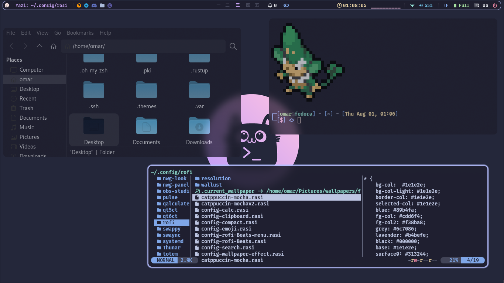
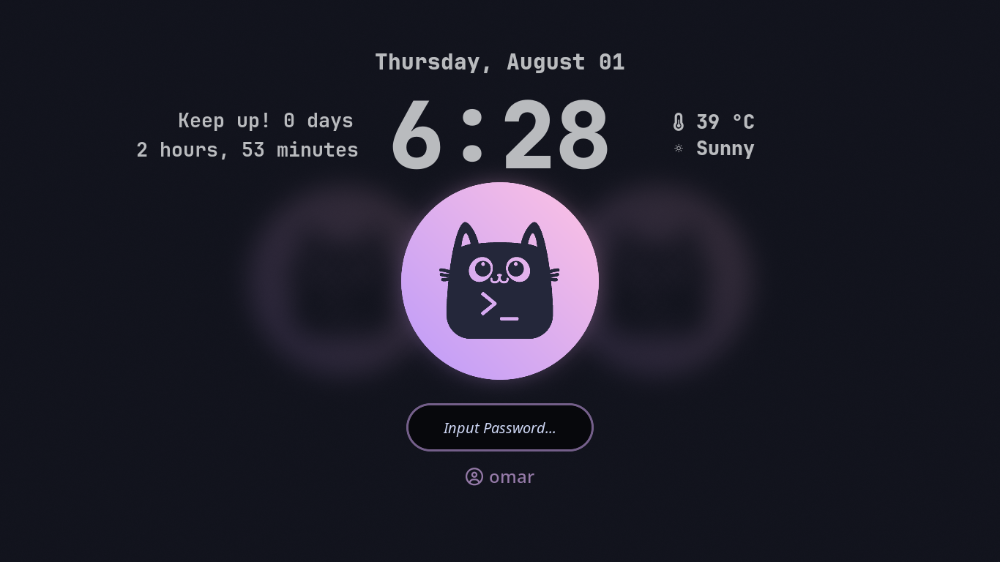
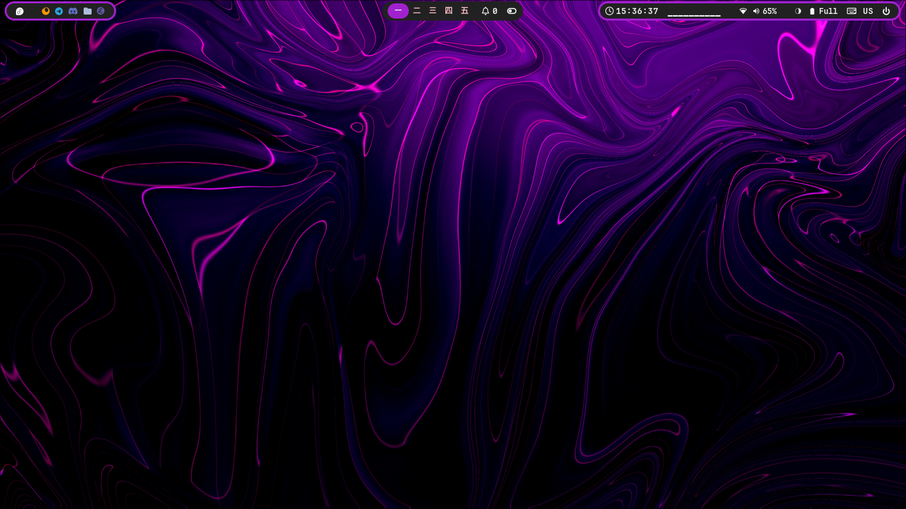
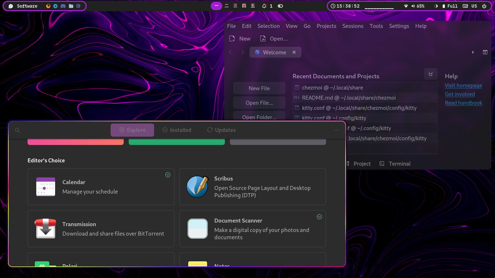
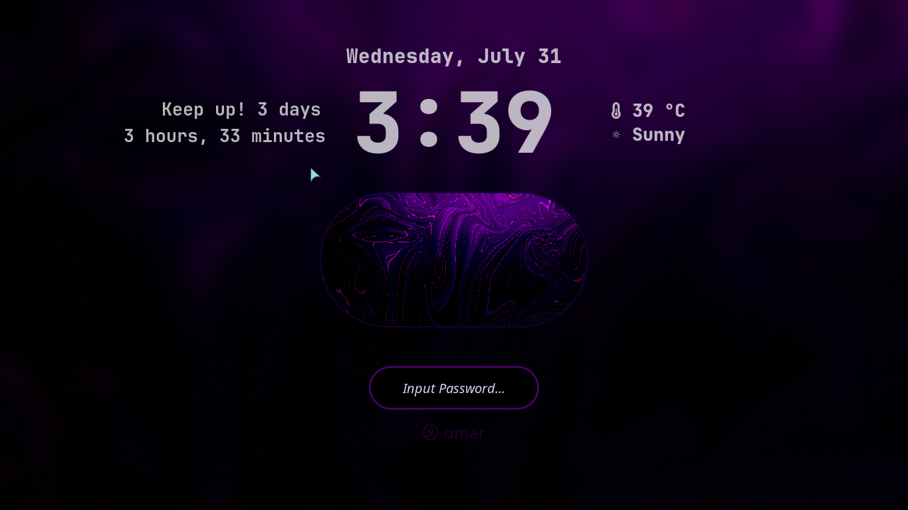
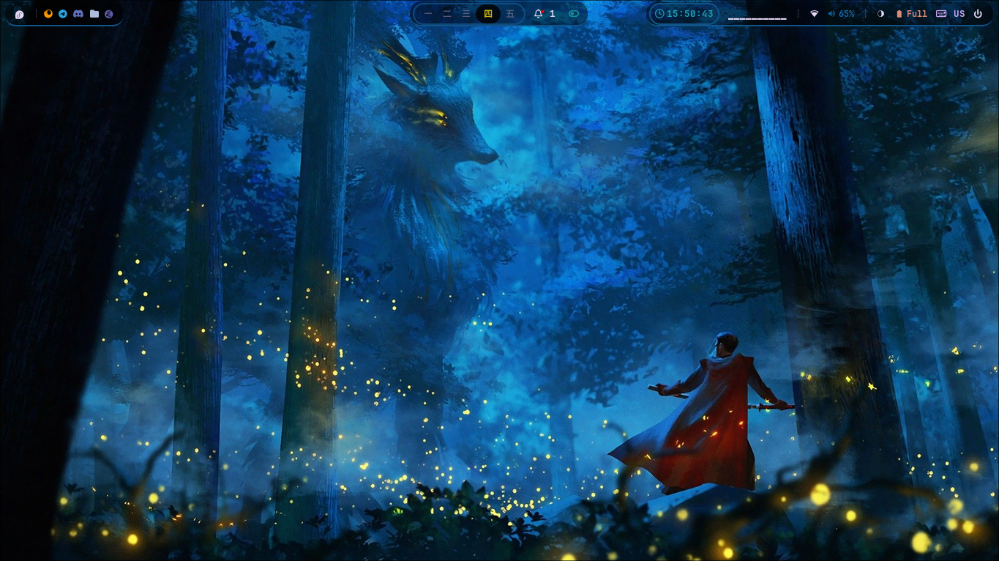
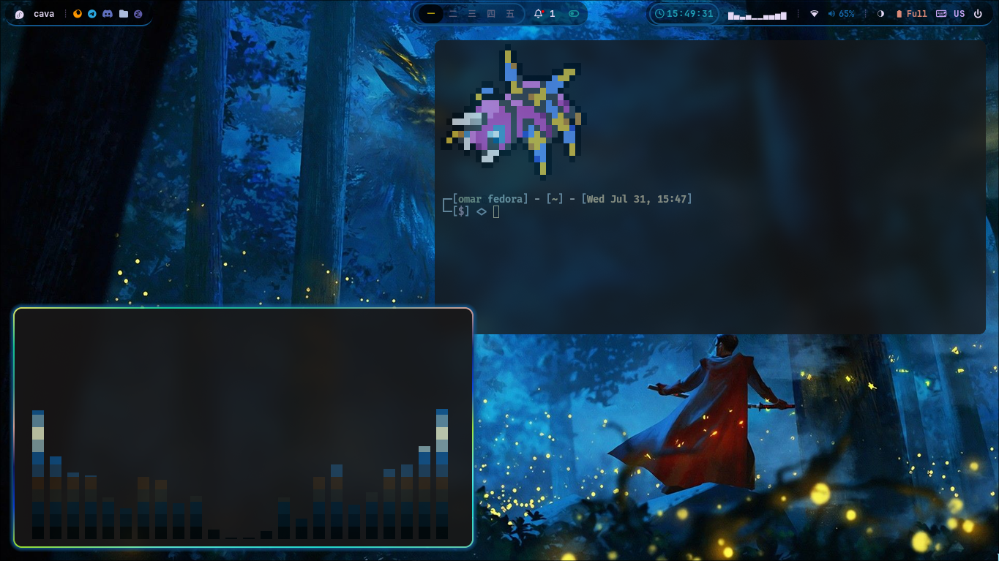
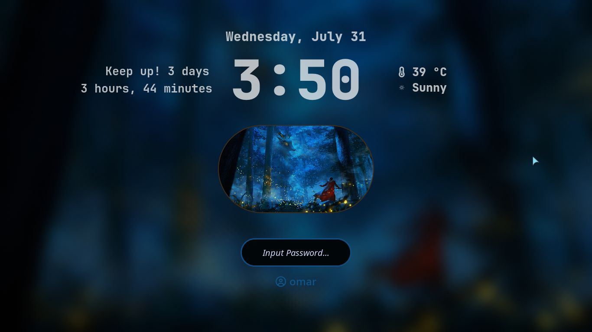
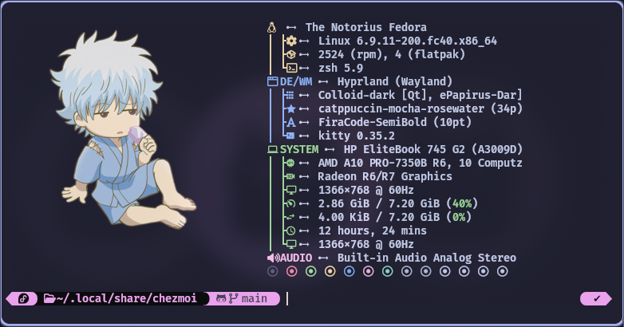

# Hyprland Dotfiles

These are my Hyprland configuration files. They are based on [JaKooLit's Hyprland dotfiles](https://github.com/JaKooLit/Hyprland-Dots) with custom configurations tailored to my preferences.

# Custom Configurations

**Waybar**

 - Added modules, styles, and configurations.
 - Removed duplicated Wi-Fi icon by flagging nm-applet --indicator in Startup_Apps.conf.

**Keyboard Layout**

 - Changed keyboard layout switching method: Disabled SwitchKeyboardLayout.sh by renaming it to .sh.bak. Using UserSettings.conf for kb_layout and kb_options along with the "hyprland/language" module in Waybar, update keyboard layout in UserSettings.conf under the input section. If the "hyprland/language" module doesn't work, update ~/.config/waybar/modules with your keyboard name using hyprctl devices to find it.

**Hyprlock**

 - Added scripts to display uptime on the lock screen.

**Themes**

 - Added GTK, Kvantum, Kitty, and Rofi themes for a cohesive look across all apps.
 - Personalized appearance with a preferred color scheme.

# Screenshots

***Catppuccin Mocha***

***Graphite Purple Dark***

***Andromeda***

# Instructions

  - Create the following directories in your **home** directory if you don't have them: .icons and .themes.
  - Copy the contents of the project's icons and themes folders into the corresponding directories you just created.
  - Copy the contents of the project's config folder into your home directory's **.config** folder.
  - Wallpapers are integrated with **hyprlock.conf** especially flatppuccin ones, copy them into **~/Pictures/wallpapers**. The other wallpapers are **optional**
  
  **To install Powerlevel10k with Oh My Zsh:**
  
    git clone --depth=1 https://github.com/romkatv/powerlevel10k.git $ZSH_CUSTOM/themes/powerlevel10k
  
  Then Set the theme in your Zsh configuration:

    ZSH_THEME="powerlevel10k/powerlevel10k"

  - Then copy .p10k.zsh to your **home** directory

***This is how it looks***

 

# Acknowledgements

A big thank you to [JaKooLit](https://github.com/JaKooLit) for the original Hyprland dotfiles which served as the foundation for my configurations.
