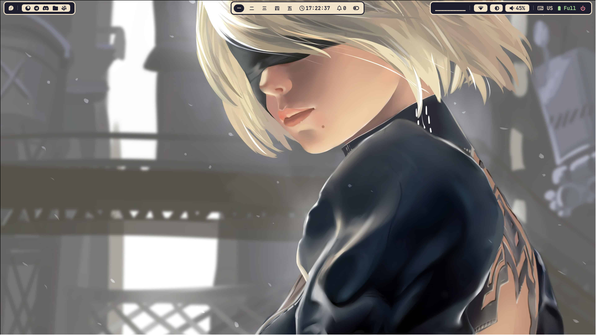
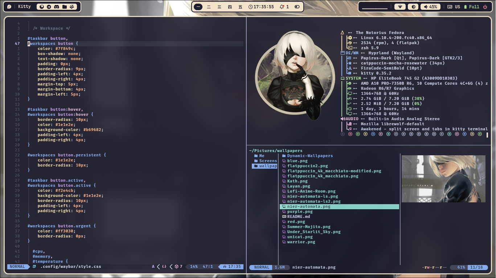
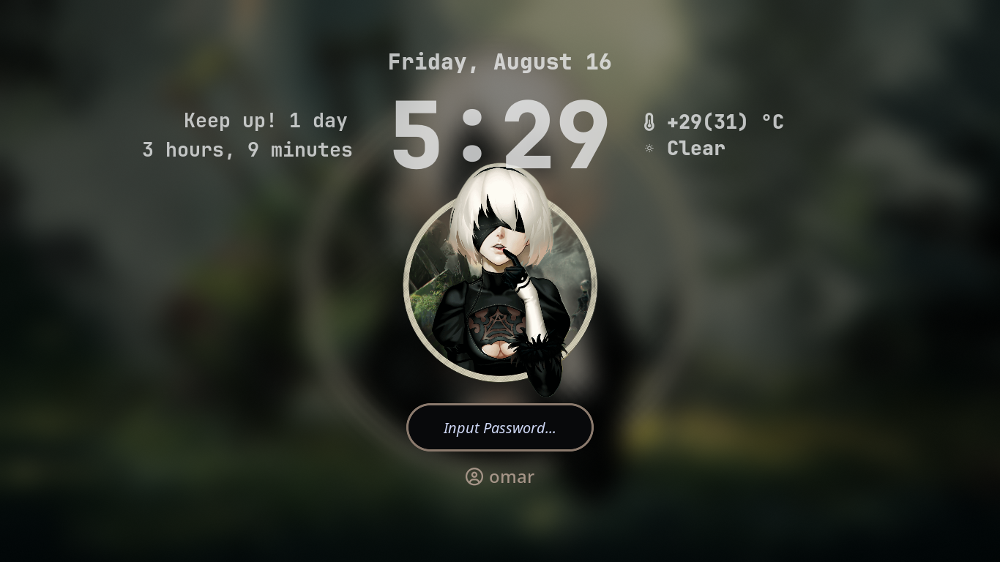
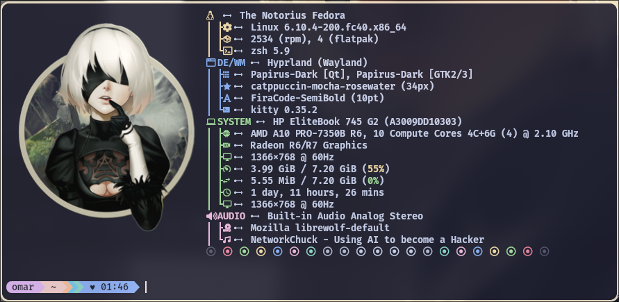

<h3 align="center">
	
	Krypton Hyprland Dotfiles
	
</h3>

<div align="center">
  
  
</div>

<div align="center">
  
### These are my Hyprland configuration files. They are based on [JaKooLit's Hyprland dotfiles](https://github.com/JaKooLit/Hyprland-Dots) with custom configurations tailored to my preferences.
</div>

# Custom Configurations

### Waybar
- Added modules, styles, and configurations.
- Removed duplicated Wi-Fi icon by flagging nm-applet --indicator in Startup_Apps.conf.

### Keyboard Layout
- Changed keyboard layout switching method: Disabled SwitchKeyboardLayout.sh by renaming it to .sh.bak. 
- Using UserSettings.conf for `kb_layout` and `kb_options` along with the "hyprland/language" module in Waybar.
- If the "hyprland/language" module doesn't work, update `~/.config/waybar/modules` with your keyboard name using `hyprctl devices` to find it.

### Hyprlock
- Added scripts to display uptime on the lock screen.

### Themes
- Added GTK, Kvantum, Kitty, and Rofi themes for a cohesive look across all apps.
- Personalized appearance with a preferred color scheme.

# Screenshots

<details>
  <summary>Catppuccin Mocha</summary>
  
  
  
</details>

<details>
  <summary>Graphite Purple</summary>
  
  
  
</details>

<details>
  <summary>Andromeda</summary>
  
  
  
</details>

<details>
  <summary>Nier Automata</summary>
  
  
  
</details>

# Installation Instructions

## Install via Script
1. Clone the repo:
   ```bash
   git clone --depth 1 https://github.com/OmarKrypton/dotfiles.git ~/Downloads

3. Run the script in your terminal:
   ```bash
   bash setup_dotfiles.sh

## Install Manually
   - Clone the repo.
   - Create the following directories in your home directory if you don't have them: .icons and .themes.
   - Copy the contents of the project's icons and themes directories into the corresponding directories you just created.
   - Copy the contents of the project's config directory into the ~/.config directory.
   - Wallpapers are integrated with hyprlock.conf, copy them into ~/Pictures/wallpapers.

## Additional Installation Instructions
  **Powerlevel10k with Oh My Zsh:**
  
    git clone --depth=1 https://github.com/romkatv/powerlevel10k.git $ZSH_CUSTOM/themes/powerlevel10k
  
  Then Set the theme in ~/.zshrc:

    ZSH_THEME="powerlevel10k/powerlevel10k"

  Then copy .p10k.zsh to your **home** directory

  
 
  **Starship:**
   
    curl -sS https://starship.rs/install.sh | sh
   
  Then Add the following to the end of ~/.zshrc:

    eval "$(starship init zsh)"
  ***Note:*** Use either Powerlevel10k or Starship.

## Example Screenshots
 
<details>
  <summary>Powerlevel10k</summary>
  
</details>

<details>
  <summary>Starship</summary>
  
</details>


# Acknowledgements

A big thank you to [JaKooLit](https://github.com/JaKooLit) for the original Hyprland dotfiles which served as the foundation for my configurations.
