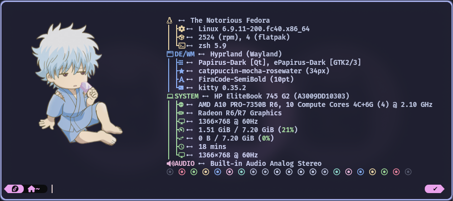

<h3 align="center">
	
	Krypton Hyprland Dotfiles
	
</h3>

 


<div align="center">
  
  
</div>


<div align="center">

 ### *These are my Hyprland configuration files. They are based on [JaKooLit's Hyprland dotfiles](https://github.com/JaKooLit/Hyprland-Dots) with custom configurations tailored to my preferences.*
</div>

# 
# Custom Configurations

**Waybar**

 - Added modules, styles, and configurations.
 - Removed duplicated Wi-Fi icon by flagging nm-applet --indicator in Startup_Apps.conf.

**Keyboard Layout**

 - Changed keyboard layout switching method: Disabled SwitchKeyboardLayout.sh by renaming it to .sh.bak. Using UserSettings.conf for kb_layout and kb_options along with the "hyprland/language" module in Waybar, update keyboard layout in UserSettings.conf under the input section. If the "hyprland/language" module doesn't work, update ~/.config/waybar/modules with your keyboard name using hyprctl devices to find it.

**Hyprlock**

 - Added scripts to display uptime on the lock screen.

**Themes**

 - Added GTK, Kvantum, Kitty, and Rofi themes for a cohesive look across all apps.
 - Personalized appearance with a preferred color scheme.


# Screenshots

<details>
  <summary>Catppuccin Mocha</summary>


</details>

<details>
  <summary>Graphite Purple</summary>
	


</details>

<details>
  <summary>Andromeda</summary>


</details>

<details>
  <summary>Nier Automata</summary>


</details>

# Instructions

## Install via script
1- Clone the repo
 ```git clone --depth 1 https://github.com/OmarKrypton/dotfiles.git ~/Downloads```


2- Run the script in your terminal ```bash setup_dotfiles.sh```

## Install manually
  - Clone the repo
  - Create the following directories in your **home** directory if you don't have them: .icons and .themes.
  - Copy the contents of the project's icons and themes directories into the corresponding directories you just created.
  - Copy the contents of the project's config directory into **~/.config** directory.
  - Wallpapers are integrated with **hyprlock.conf**, copy them into **~/Pictures/wallpapers**.
  
 
  
  **To install Powerlevel10k with Oh My Zsh:**
  
    git clone --depth=1 https://github.com/romkatv/powerlevel10k.git $ZSH_CUSTOM/themes/powerlevel10k
  
  Then Set the theme in your Zsh configuration:

    ZSH_THEME="powerlevel10k/powerlevel10k"

  Then copy .p10k.zsh to your **home** directory

  
 
  **To install Starship:**
   
    curl -sS https://starship.rs/install.sh | sh
   
  Then Add the following to the end of ~/.zshrc:

    eval "$(starship init zsh)"
    
  
  ***NOTE:*** Use either Powerlevel10k or starship.


  ***p10k***

   

  **Starship**

  


# Acknowledgements

A big thank you to [JaKooLit](https://github.com/JaKooLit) for the original Hyprland dotfiles which served as the foundation for my configurations.
